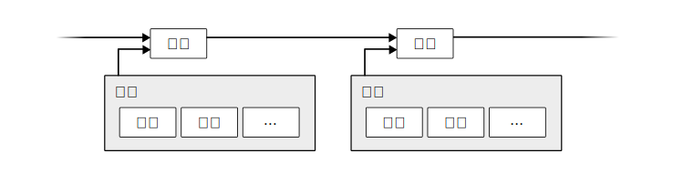

# 3 时间戳服务器 (Timestamp Server) —— 区块的链

## 原文与翻译

The solution we propose begins with a timestamp server. A timestamp server works by taking a hash of a block of items to be timestamped and widely publishing the hash, such as in a newspaper or Usenet post**[2-5]**. The timestamp proves that the data must have existed at the time, obviously, in order to get into the hash. Each timestamp includes the previous timestamp in its hash, forming a chain, with each additional timestamp reinforcing the ones before it.

本解决方案起步于一种时间戳服务器。时间戳服务器是这样工作的：为一组（block）记录（items）的哈希打上时间戳，而后把哈希广播出去，就好像一份报纸所做的那样，或者像是在新闻组（Usenet）里的一个帖子那样**[2-5]**。显然，时间戳能够证明那数据在那个时间点之前已然存在，否则那哈希也就无法生成。每个时间戳在其哈希中包含着之前的时间戳，因此构成了一个链，此条链上的每一个新的时间戳被添加在之前的时间戳之后。



**[2]:** Design of a secure timestamping service with minimal trust requirements Henri Massias, Xavier Serret-Avila, Jean-Jacques Quisquater 20th Symposium on Information Theory in the Benelux (1999-05) http://citeseerx.ist.psu.edu/viewdoc/summary?doi=10.1.1.13.6228

**[3]:** How to time-stamp a digital document Stuart Haber, W.Scott Stornetta Journal of Cryptology (1991) https://doi.org/cwwxd4 DOI: 10.1007/bf00196791 

**[4]:** Improving the Efficiency and Reliability of Digital Time-Stamping Dave Bayer, Stuart Haber, W. Scott Stornetta Sequences II (1993) https://doi.org/bn4rpx DOI: 10.1007/978-1-4613-9323-8_24 

**[5]:** Secure names for bit-strings Stuart Haber, W. Scott Stornetta Proceedings of the 4th ACM conference on Computer and communications security - CCS ’97(1997) https://doi.org/dtnrf6 

## 重要概念解析


- [时间戳](https://en.bitcoin.it/wiki/Block_timestamp)

    计算机对某一时刻的记录，通常用以区分事件（例如：区块生成）的先后顺序（来源：[维基百科](https://en.wikipedia.org/wiki/Timestamp)）。
    时间戳机制的逻辑是这样的：**包含时间戳的数据进行哈希运算得到哈希值 -> 不可能在哈希值不变的情况下篡改时间戳 -> 事件必然在时间戳之前发生。** 
    
   【讨论】时间戳的在区块链中的真正意义？
   
    **【Python 知识点】** 点击链接跳转至《自学是门手艺》相应知识点
    - [值——值的类型](https://github.com/selfteaching/the-craft-of-selfteaching/blob/master/Part.1.E.2.values-and-their-operators.ipynb)


```python
# 生成时间戳
import time
ts = int(time.time())
print(ts) # 10 位时间戳
```

    1559912492


- 时间戳服务器

    本文中的「时间戳服务器」，实际上就是「出块节点（Block Producter）」，它安装在每一个「矿工」的「矿机」上。

## 50 行代码构建区块链

只要 50 行 Python 代码，我们就能构建出最小必要模型，实践本节所说的「区块（Block）」之「链（Chain）」。

本段代码出处：

https://blog.csdn.net/qiansg123/article/details/80130757

**【Python 知识点】** 点击链接跳转至《自学是门手艺》相应知识点

- [函数 —— 关于参数](https://github.com/selfteaching/the-craft-of-selfteaching/blob/master/Part.2.D.1-args.ipynb)
- [类 —— Python 的实现](https://github.com/selfteaching/the-craft-of-selfteaching/blob/master/Part.3.B.2.classes-2.ipynb)


```python
import hashlib as hasher

# 定义区块类
class Block:
    def __init__(self, index, timestamp, data, previous_hash):
        self.index = index
        self.timestamp = timestamp
        self.data = data
        self.previous_hash = previous_hash
        self.hash = self.hash_block()

    def hash_block(self):
        sha = hasher.sha256()
        sha.update(
            bytes(
                str(self.index) + str(self.timestamp) + str(self.data) + str(
                    self.previous_hash), 'utf-8'))
        return sha.hexdigest()
```

比特币[真实的区块结构](https://en.bitcoin.it/wiki/Block_hashing_algorithm)：


上述模型的代码，对字段进行了简化与调整。


```python
import datetime as date
# 「创世区块」创建函数
def create_genesis_block():
    #  Manually construct a block with index 0 and arbitrary previous hash
    return Block(0, date.datetime.now(), "Genesis Block", "0")

# 生成创世区块
genesis_block = create_genesis_block()

print("genesis_block height: {}".format(genesis_block.index))
print("genesis_block hash: {}".format(genesis_block.hash))

```

    genesis_block height: 0
    genesis_block hash: 2ccc4063e8fa70ff6b720508eea10c32bbc82672403dbb5a859a4845a4d2e45d


- [创世区块](https://en.bitcoin.it/wiki/Genesis_block)

    创世区块是一条区块链的第一个区块，现在的比特币版本将其标记为第0块（Block Zero）。

**【彩蛋】** 中本聪在比特币的创世区块中留下了一句话：

The Times 03/Jan/2009 Chancellor on brink of second bailout for banks.

这是 2009 年 1 月 3 日那天泰晤士报的首页新闻标题，有人认为中本聪用这个标题暗示了他创建比特币系统的目的。


```python
# 生成下个区块的函数
def next_block(last_block):
    this_index = last_block.index + 1
    this_timestamp = date.datetime.now()
    this_data = "Hey! I'm block " + str(this_index)
    this_hash = last_block.hash
    return Block(this_index, this_timestamp, this_data, this_hash)
```

**【Python 知识点】** 点击链接跳转至《自学是门手艺》相应知识点

- [流程控制 —— for 循环](https://github.com/selfteaching/the-craft-of-selfteaching/blob/master/Part.2.D.1-args.ipynb)
- [数据容器 —— 列表](https://github.com/selfteaching/the-craft-of-selfteaching/blob/master/Part.1.E.6.containers.ipynb)


```python
# 用上述函数生成 20 个区块，构成区块链
blockchain = [genesis_block]
previous_block = blockchain[0]

# How many blocks should we add to the chain
# after the genesis block
num_of_blocks_to_add = 20

# Add blocks to the chain
for i in range(0, num_of_blocks_to_add):
  block_to_add = next_block(previous_block)
  blockchain.append(block_to_add)
  previous_block = block_to_add
  
  print("Block #{} has been added to the blockchain!".format(block_to_add.index))
  print("Hash: {}\n".format(block_to_add.hash))
```

    Block #1 has been added to the blockchain!
    Hash: d8b5365fa3ea02116acc6bbd2d9785c4fb8d391f6098aab5081b142c9f295c74
    
    Block #2 has been added to the blockchain!
    Hash: 3c78096d7b49ad4e1ca0f0e42c9037ab022707c4d17bee7573f5e6279d24efb0
    
    Block #3 has been added to the blockchain!
    Hash: e8315509fe28382b0e2811bae9032a4dae23c90397019756bcf0b7c475ace8c5
    
    Block #4 has been added to the blockchain!
    Hash: d64bba31f69356b1ba101f91e651fb3585680f7b03caec271c1af0a1ad23c7d5
    
    Block #5 has been added to the blockchain!
    Hash: e0a0dc37dbcb800e0191948950ffd0889001001a3d9c6a80935bf94d4b7ab90f
    
    Block #6 has been added to the blockchain!
    Hash: e90da4426196209056803e28e32509bd8307e508866f837e4ec4803cee5c9aef
    
    Block #7 has been added to the blockchain!
    Hash: 7f75467a5410fa792375dd743733cbc22cebb9f8412edc76475848e456fc7e96
    
    Block #8 has been added to the blockchain!
    Hash: 8b039d7970a3cfe04aff0cf220450fdde0a60a70a97fa8d8c15ce86ed26f44df
    
    Block #9 has been added to the blockchain!
    Hash: 87ef881e25d3bb0ff0e3f47d48f0ace0f42449f2e959d82c1aebb304d63f0fad
    
    Block #10 has been added to the blockchain!
    Hash: e5b24ad7dc290cbcdb1cda272e729ba1e7a6bcc75af7eaf392112245c2bd0643
    
    Block #11 has been added to the blockchain!
    Hash: 117d94eaccfda466ebf8e48411a780f93f835754c0f2c5b46bcaca0c84785b34
    
    Block #12 has been added to the blockchain!
    Hash: 338318a077ed63a80588ec2375264c3a80d04d535ddcc7d09776824212744188
    
    Block #13 has been added to the blockchain!
    Hash: 398a44f9841ce3a98625be2f79c87ff49bd649b02732ea338b7ed6ce6d443b50
    
    Block #14 has been added to the blockchain!
    Hash: deff3fb9789fb01cedc375cf392d339275dfc2ef08b16953b5163f0456687e8f
    
    Block #15 has been added to the blockchain!
    Hash: 4c10601088713bfeeabea00ee9a884d2a80b920aecac06b0f1667a8ab14df360
    
    Block #16 has been added to the blockchain!
    Hash: 653ea9eb69bec573597d7e22692b19bd737f6fee340a17debc319ab4f835c6c7
    
    Block #17 has been added to the blockchain!
    Hash: 9f26ff3537af763a75a53e8810d550cb6edee51aa3b9a00e527d601f841bb4f5
    
    Block #18 has been added to the blockchain!
    Hash: 2b4767f320d04ff8490e9cb90615316369fac897b9f0776d072ab118d12c9f53
    
    Block #19 has been added to the blockchain!
    Hash: 1a8d465eb7848132d771a82d6e48ee089e14fcae1ef6d175753d3b3c930e5f64
    
    Block #20 has been added to the blockchain!
    Hash: 7342b5dc23228ec255d3b561669954d8564c8f9a57598dcc85dbdeef95aa7f98
    


这种 [单项链表结构](https://en.wikipedia.org/wiki/Linked_list#Singly_linked_list) ，确保了**一旦对过去的区块内容进行篡改，则那个区块之后的所有区块的哈希值都会发生变动。** 

那么，又如何确保系统中存在一条唯一的合法的链呢？在 [5 Network]( https://github.com/leeduckgo/bitcoin_elementary_course_based_on_jupyterlab/blob/master/5%20Network_%E7%BD%91%E7%BB%9C.ipynb)一章中对此有所描述。
