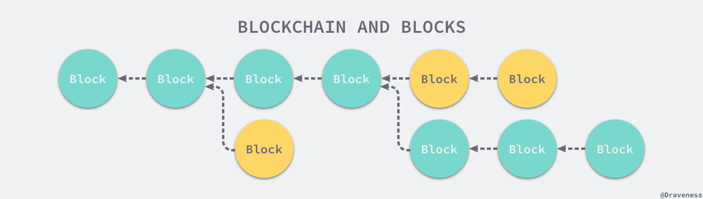

# 5 网络 (Network)

## 前言

在 Transactions、Timestamp Server、Proof-of-Work 这三节的基础上，Network 这一节简明地阐述了区块链网络的运行机理。

可以说，看懂这四节，就算是「入门」比特币了。

## 原文与翻译

The steps to run the network are as follows:

> 1. New transactions are broadcast to all nodes.
> 2. Each node collects new transactions into a block.
> 3. Each node works on finding a difficult proof-of-work for its block.
> 4. When a node finds a proof-of-work, it broadcasts the block to all nodes.
> 5. Nodes accept the block only if all transactions in it are valid and not already spent.
> 6. Nodes express their acceptance of the block by working on creating the next block in the chain, using the hash of the accepted block as the previous hash.

运行网络的步骤如下：

> 1. 所有新的交易向所有节点广播；
> 2. 每个节点将新交易打包到一个区块；
> 3. 每个节点开始为此区块找一个具备难度的工作证明；
> 4. 当某个区块找到其工作证明，它就要将此区块广播给所有节点；
> 5. 众多其他节点当且只当以下条件满足才会接受这个区块：其中所有的交易都是有效的，且未被双重支付；
> 6. 众多节点向网络表示自己接受这个区块的方法是，在创建下一个区块的时候，把被接受区块的哈希当作新区块之前的哈希。

Nodes always consider the longest chain to be the correct one and will keep working on extending it. If two nodes broadcast different versions of the next block simultaneously, some nodes may receive one or the other first. In that case, they work on the first one they received, but save the other branch in case it becomes longer. The tie will be broken when the next proof-of-work is found and one branch becomes longer; the nodes that were working on the other branch will then switch to the longer one.

节点始终认为最长链是正确的那个，且会不断向其添加新数据。若是有两个节点同时向网络广播了两个不同版本的「下一个区块」，有些节点会先接收到其中一个，而另外一些节点会先接收到另外一个。这种情况下，节点将在它们先接收到的那个区块上继续工作，但也会把另外一个分支保存下来，以防后者成为最长链。当下一个工作证明被找到，而其中的一个分支成为更长的链之后，这个暂时的分歧会被打消，在另外一个分支上工作的节点们会切换到更长的链上。

New transaction broadcasts do not necessarily need to reach all nodes. As long as they reach many nodes, they will get into a block before long. Block broadcasts are also tolerant of dropped messages. If a node does not receive a block, it will request it when it receives the next block and realizes it missed one.

新的交易不见得一定要广播到达所有的节点。只要到达足够多的节点，那么没多久这些交易就会被打包进一个区块。区块广播也容许一些消息被丢弃。如果一个节点并未接收到某个区块，那么这个节点会在它接收到下一个区块的时候意识到自己错失了之前的区块，因此会发出补充那个遗失区块的请求。

## 比特币网络运行步骤大白话版

假设比特币网络里有四个矿工，分别是小猪小兔小狗小鹿小鸟……

他们四人在接收别人发过来的区块的同时辛勤挖矿……

突然，小猪和小兔同时挖出了一个 Nonce，都在 12345 这个高度创建了一个区块。他们向全网广播了他们的区块。

小狗和小鹿都先接收到了小猪的区块，又接收到了小兔的区块。于是它们两个在小猪的区块上继续挖矿……

但是，由于网络问题，小鸟先接收到的是小兔的区块，再接收到的是小猪的区块。于是小鸟在小兔的区块上继续挖矿……

小鸟的算力比较强劲，它先于小狗和小鹿挖到了块，块高为 12345 + 1 = 12346。它将这个块广播了出去。

其它所有人收到了这个块，然后比较，包含小兔挖到的区块的链的高度 = 12346 > 包含小猪挖到的区块的链 = 12345，所以选择前者，抛弃后者。

**如此，就能保证即使有「临时分叉」，但最终「只有一条确定的链」。**

> 
>
> 在上述区块链网络中，绿色的区块都被包含在主链中，所有黄色的区块都是孤块（Orphan Block），它们没有被主链接受，在每一个区块链网络中只能有一条主链，也就是最长的有效链，也是当前区块链网络中所有节点达成的共识。
> ——[Draveness](https://draveness.me/utxo-account-models)

## 一个可视化理解「基于 PoW 共识机制的区块链」的网站

https://blockchaindemo.io/
