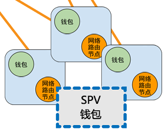

# 8 简化版支付确认（Simplified Payment Verification Privacy）

## 原文与翻译

It is possible to verify payments without running a full network node. A user only needs to keep a copy of the block headers of the longest proof-of-work chain, which he can get by querying network nodes until he's convinced he has the longest chain, and obtain the Merkle branch linking the transaction to the block it's timestamped in. He can't check the transaction for himself, but by linking it to a place in the chain, he can see that a network node has accepted it, and blocks added after it further confirm the network has accepted it.

即便不用运行一个完整网络节点也有可能确认支付。用户只需要有一份拥有工作证明的最长链的区块头拷贝 —— 他可以通过查询在线节点确认自己确实拥有最长链，同时获取一条 Merkle 树的分支 —— 该分支将交易和「将其打上时间戳后置入」的区块连接起来。用户并不能自己检查交易，但，通过将交易连接到链上的某个地方，他可以看到某个网络节点已经接受了这个交易，而此后加进来的区块进一步确认了网络已经接受了此笔交易。


As such, the verification is reliable as long as honest nodes control the network, but is more vulnerable if the network is overpowered by an attacker. While network nodes can verify transactions for themselves, the simplified method can be fooled by an attacker's fabricated transactions for as long as the attacker can continue to overpower the network. One strategy to protect against this would be to accept alerts from network nodes when they detect an invalid block, prompting the user's software to download the full block and alerted transactions to confirm the inconsistency. Businesses that receive frequent payments will probably still want to run their own nodes for more independent security and quicker verification.

只要诚实节点依然在掌控网络，如此这般，验证即为可靠的。然而，如果网络被攻击者所控制的时候，验证就没那么可靠了。尽管网络节点可以自己验证交易记录，但是，只要攻击者能够继续控制网络的话，那么简化版验证方式可能会被攻击者伪造的交易记录所欺骗。应对策略之一是，客户端软件要接受来自网络节点的警告。当网络节点发现无效区块的时候，即发出警报，在用户的软件上弹出通知，告知用户下载完整区块，警告用户确认交易一致性。那些有高频收付发生的商家应该仍然希望运行属于自己的完整节点，以此保证更独立的安全性和更快的交易确认。


## 轻量节点的意义

>并非所有的节点都有能力储存完整的区块链。许多比特币客户端被设计成运行在空间和效率受限的设备上，如智能电话、平板电脑、嵌入式系统等。通过简化的支付验证方式可以使它们在不必存储完整区块链的情况下进行工作。
>
>——《精通比特币》6.7 ：http://v1.8btc.com/books/261/master_bitcoin/_book/6/6.html

## 轻量节点和全节点的关系



SPV 节点是这样工作的：

1. 根据钱包里的地址，把地址创建以前的区块头全部下载下来；
2. 对于之后的区块，则由全节点提供我们关心的交易（比如发送到我们钱包地址的交易）以及这个交易在某个区块的证明；
3. 关心的交易被记入区块后又有若干个新的区块头，则确信交易已经被确认。

## 实践 Merkle Tree 交易验证


**注：** 本图来自 [Draveness 的博客](https://draveness.me/utxo-account-models)

【Python 知识点】 点击链接跳转至《自学是门手艺》相应知识点
- [函数](https://github.com/selfteaching/the-craft-of-selfteaching/blob/master/Part.2.D.1-args.ipynb)
- [流程控制 —— for 循环](https://github.com/selfteaching/the-craft-of-selfteaching/blob/master/Part.1.E.3.controlflow.ipynb)


```python
import import_ipynb
from IPython.display import display, Markdown
import hashlib,json
import others.merkle_tree as mk_tree
display(Markdown("**First Example - Even number of transaction Merkel Tree**"))
display(Markdown('**Final root of the tree:** \n\n' + mk_tree.Jae_Tree.get_root_leaf()))
display(Markdown("**merkle tree:** \n\n" + json.dumps(mk_tree.past_transaction, indent=4)))
## =====================
display(Markdown("**verify tx by merkle tree:**"))
def verify_tx_by_merkle_tree(tx, leafs, root):
    current = tx
    for leaf in leafs:
        current = hashlib.sha256((current + leaf).encode()).hexdigest()
    return current==root
tx = "ca978112ca1bbdcafac231b39a23dc4da786eff8147c4e72b9807785afee48bb"
tx_2 = "ca978112ca1bbdcafac231b39a23dc4da786eff8147c4e72b9807785afee48bd"
leafs = ["3e23e8160039594a33894f6564e1b1348bbd7a0088d42c4acb73eeaed59c009d", "d3a0f1c792ccf7f1708d5422696263e35755a86917ea76ef9242bd4a8cf4891a"]
root = "58c89d709329eb37285837b042ab6ff72c7c8f74de0446b091b6a0131c102cfd"

print("tx 1: " + str(verify_tx_by_merkle_tree(tx, leafs, root)))
print("tx 2: " + str(verify_tx_by_merkle_tree(tx_2, leafs, root)))
```


**First Example - Even number of transaction Merkel Tree**


**Final root of the tree:** 

58c89d709329eb37285837b042ab6ff72c7c8f74de0446b091b6a0131c102cfd


**merkle tree:** 

{
    "a": "ca978112ca1bbdcafac231b39a23dc4da786eff8147c4e72b9807785afee48bb",
    "b": "3e23e8160039594a33894f6564e1b1348bbd7a0088d42c4acb73eeaed59c009d",
    "c": "2e7d2c03a9507ae265ecf5b5356885a53393a2029d241394997265a1a25aefc6",
    "d": "18ac3e7343f016890c510e93f935261169d9e3f565436429830faf0934f4f8e4",
    "ca978112ca1bbdcafac231b39a23dc4da786eff8147c4e72b9807785afee48bb3e23e8160039594a33894f6564e1b1348bbd7a0088d42c4acb73eeaed59c009d": "62af5c3cb8da3e4f25061e829ebeea5c7513c54949115b1acc225930a90154da",
    "2e7d2c03a9507ae265ecf5b5356885a53393a2029d241394997265a1a25aefc618ac3e7343f016890c510e93f935261169d9e3f565436429830faf0934f4f8e4": "d3a0f1c792ccf7f1708d5422696263e35755a86917ea76ef9242bd4a8cf4891a",
    "62af5c3cb8da3e4f25061e829ebeea5c7513c54949115b1acc225930a90154dad3a0f1c792ccf7f1708d5422696263e35755a86917ea76ef9242bd4a8cf4891a": "58c89d709329eb37285837b042ab6ff72c7c8f74de0446b091b6a0131c102cfd"
}


**verify tx by merkle tree:**


    tx 1: True
    tx 2: False

